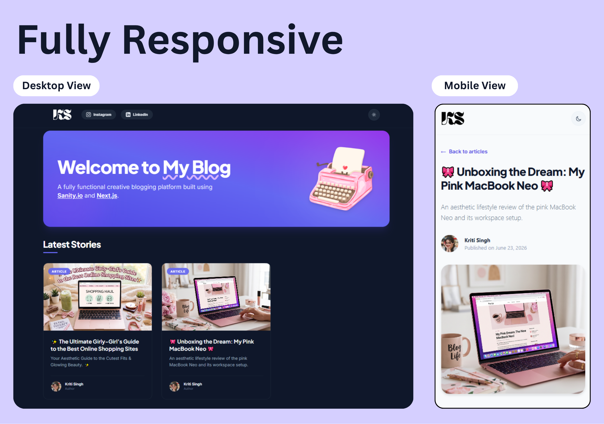
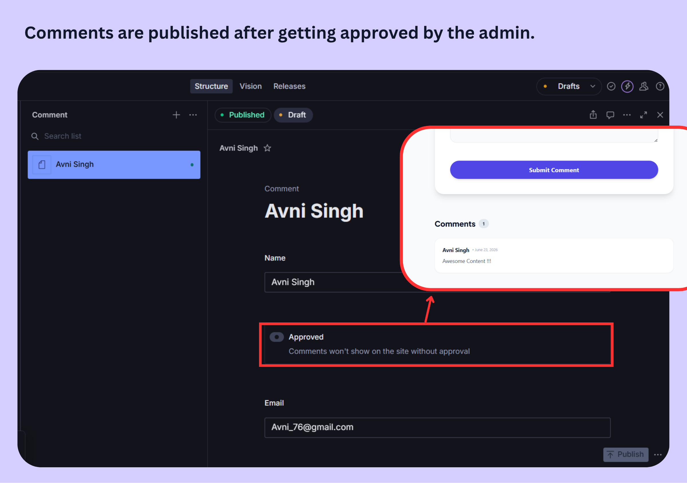

# Personal Blogging Website

A modern, responsive, and high-performance blogging website. Built using **Next.js**, **Tailwind CSS**, and **TypeScript** for the frontend, with **Sanity.io** as the Content Management System (CMS) for backend content management and comments storage.



---

## 🚀 Features

- **Dynamic Routing**: Built with Next.js dynamic routing (`pages/post/[slug].tsx`) for individual blog posts.
- **Incremental Static Regeneration (ISR)**: Static page generation that automatically regenerates post pages in the background when content changes.
- **Sanity CMS Integration**: Seamless management of authors, posts, categories, and comment moderation.
- **Interactive Comment System**: Users can submit comments on blog posts, which are sent via a Next.js API route directly to the Sanity dataset for moderation.
- **Dark Mode**: Integrated light/dark theme toggle with persistent storage using `localStorage` and system theme detection.
- **Social Connect**: Custom brand-styled, animated navigation buttons for Instagram and LinkedIn.
- **Fully Responsive Design**: Optimized layouts for mobile, tablet, and desktop screens using Tailwind CSS.

---

## 🛠️ Tech Stack

- **Frontend Framework**: [Next.js](https://nextjs.org/) (React 17)
- **Styling**: [Tailwind CSS](https://tailwindcss.com/)
- **CMS / Database**: [Sanity.io](https://www.sanity.io/)
- **Programming Language**: [TypeScript](https://www.typescriptlang.org/)
- **Deployment**: [Vercel](https://vercel.com/)

---

## 📂 Project Structure

```text
├── components/          # Reusable UI components
│   ├── header.tsx       # Navigation bar with dark mode toggle & social links
│   ├── hero.tsx         # Responsive welcome banner
│   └── footer.tsx       # Bottom footer layout
├── pages/               # Next.js Pages & Routing
│   ├── _app.tsx         # Custom App configuration
│   ├── index.tsx        # Homepage (Lists all blog posts)
│   ├── api/
│   │   └── createComment.ts # Handler for comment submission to Sanity
│   └── post/
│       └── [slug].tsx   # Dynamic blog post details & comment form
├── studio/              # Sanity.io Studio configuration & schemas
│   ├── schemaTypes/     # Schema definitions
│   │   ├── author.ts    # Author schema
│   │   ├── comment.ts   # Comment schema
│   │   ├── post.ts      # Post schema
│   │   └── index.ts     # Schema registry
│   ├── sanity.config.ts # Sanity studio configurations
│   └── sanity.cli.ts    # Sanity CLI settings
├── public/              # Static assets (images, icons, etc.)
├── styles/              # Global stylesheet & Tailwind directives
├── sanity.js            # Frontend Sanity client configuration
└── package.json         # Project dependencies & script configurations
```

---

## ⚙️ Environment Configuration

To run the project, you need to configure the connection to your Sanity project. Create a `.env.local` file in the root directory and add the following keys:

```env
NEXT_PUBLIC_SANITY_DATASET=production
NEXT_PUBLIC_SANITY_PROJECT_ID=your_sanity_project_id
SANITY_API_TOKEN=your_sanity_write_token
```

> [!NOTE]
> The `SANITY_API_TOKEN` requires **Write** permissions to enable comment submissions to the dataset. You can generate this under the **API** tab of your Sanity project dashboard at [manage.sanity.io](https://manage.sanity.io).

---

## 💻 Local Setup & Development

### 1. Prerequisites
Make sure you have Node.js (version 14 or higher) and npm installed.

### 2. Clone and Install Dependencies
```bash
# Install root dependencies (Next.js Frontend)
npm install

# Install Sanity Studio dependencies
cd studio
npm install
cd ..
```

### 3. Run Development Servers
You can run both the frontend and the Sanity Studio locally at the same time:

#### Frontend Development Server:
```bash
# In the root directory
npm run dev
```
The frontend will be available at [http://localhost:3000](http://localhost:3000).

#### Sanity Studio Development Server:
```bash
# In the studio/ directory
cd studio
npm run dev
```
The Sanity Studio will be available at [http://localhost:3333](http://localhost:3333). Here you can manage posts, authors, and comments.

---

## 💬 Admin Approved Commenting System

The project features a admin approved commenting system on each blog post page, allowing readers to share their thoughts.



### How It Works:
1. **User Submission**: Readers can submit comments using the comment form under each post, providing their name, email, and comment.
2. **API Route Processing**: Submissions are sent to the Next.js API route (`pages/api/createComment.ts`).
3. **Database Write**: The API handler utilizes the Sanity Client configured with a secure `SANITY_API_TOKEN` to write the comment document to the database.
4. **Moderation/Approval**: Comments are saved to Sanity CMS with an unapproved state by default. The blog administrator can review, moderate, and approve comments inside the **Sanity Studio** panel before they are rendered on the live blog post.

---

## 🧱 Sanity CMS Content Schemas

The following document schemas are pre-configured inside `studio/schemaTypes`:
- **Author**: Define blogger profiles with a name, slug, bio, and profile image.
- **Post**: Write posts using a rich Portable Text editor, attach authors, categories, main images, and publication dates.
- **Comment**: Automatically populated when a user submits comments from the frontend. Comments can be approved/moderated within the studio before they appear on the live site.

---

## 🚀 Production Build & Deployment

### Build Locally
To check the production-readiness of the Next.js frontend:
```bash
npm run build
```

### Deploy to Vercel
1. Push your code repository to GitHub/GitLab/Bitbucket.
2. Link the repository to your [Vercel Dashboard](https://vercel.com).
3. Configure the environment variables (`NEXT_PUBLIC_SANITY_PROJECT_ID`, `NEXT_PUBLIC_SANITY_DATASET`, and `SANITY_API_TOKEN`) in the Vercel project settings.
4. Vercel will automatically build and deploy the project.
